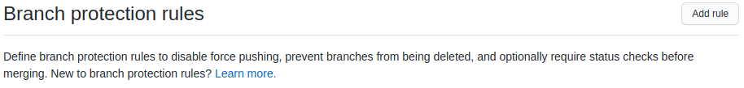
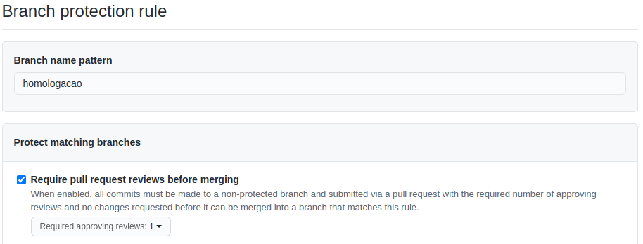

# GitFlow TIFDRP

GitFlow da Seção de Informática da FDRP.

>## Criando um repositório
### GitHub
- Criar o repositório com nome e descrição que façam sentido
- Gerar o arquivo README.md na criação do repo

### Máquina Local
- Clonar o repositório:
  - `git clone git@repoaddress/repo.git`
  - `cd repo/`
- Criar um branch chamado homologacao:
  - `git checkout -b homologacao`
- Mandar o branch homologacao para o remoto:
  - `git push origin homologacao`
- Trackear o branch develop local o com homologacao remoto:
  - `git branch --set-upstream-to=origin/homologacao`

### GitHub
- Alterar o branch default para homologacao `Repositório > Settings > Branches`
- Proteger as branches públicas `Repositório > Settings > Branches`

Clicar em Add Rule

Colocar o nome do branch e marcar opção `Require pull request reviews before merging`

 
 

>## Contribuindo com um projeto
### GitHub
- Criar issue, se não exisitir

### Máquina Local
- Clonar o repositório, se não tiver:
  - `git clone git@repoaddress/repo.git`
  - `cd repo/`
- Entrar no branch homologacao e atualizá-lo:
  - `git checkout homologacao`
  - `git pull`
- Criar um branch de desenvolvimento a partir do branch homologacao para resolver a issue:
  - `git checkout -b nome-do-branch`
- Criar os códigos que resolvam a issue.
- Commit das alterações:
  - `git add arquivos-alterados` ou `git add .`
  - `git commit -m "msg do commit resolve #issueid`
- Mandar o branch de desenvolvimento para o GitHub
  - `git push origin nome-do-branch`

### GitHub
- Abrir um PullRequest para o branch homologacao
- Se possível, pedir para alguém revisar o código para aceitar o PullRequest no branch homologacao
- Conferir se o deploy foi feito no servidor de homologação

### Maquina Local

Se o deploy para o servidor de homologação tiver dado certo:
- Entrar no branch homologacao e atualizá-lo:
  - `git checkout homologacao`
  - `git pull`
- Remover o branch de desenvolvimento
  - `git branch -d nome-do-branch`

 

>## Criando um Hotfix

**Máquina Local**
- Clonar o repositório, se não tiver:
  - `git clone git@repoaddress/repo.git`
  - `cd repo/`
- Entrar no branch master e atualizá-lo:
  - `git checkout master`
  - `git pull`
- Criar um branch de hotfix a partir do master para reolver o problema:
  - `git checkout -b nome-do-branch`
- Criar os códigos que resolvam o problema.
- Commit das alterações:
  - `git add arquivos-alterados` ou `git add .`
  - `git commit -m "msg do commit"`
- Mandar o branch do hotfix para o GitHub:
  - `git push origin nome-do-branch`

### GitHub
- Abrir um PullRequest para o branch master
- Se possível, pedir para alguém revisar o código para aceitar o PullRequest no branch master
- Conferir se o deploy foi feito no servidor de produção

### Maquina Local
Se o deploy para o servidor de produção tiver dado certo:
- Entrar no branch master e atualizá-lo:
  - `git checkout master`
  - `git pull`
- Remover o branch de hotfix
  - `git branch -d nome-do-branch`
